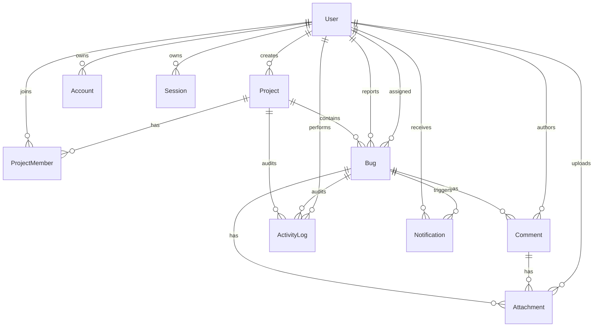
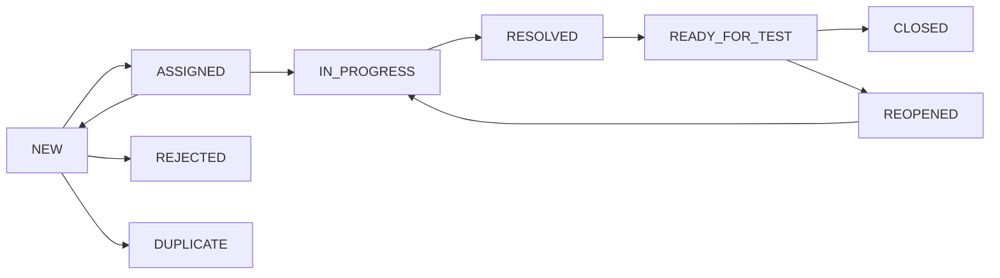

# BugFlow

BugFlow is a full-stack bug tracking and issue management system for software teams of 5–30 people. It is designed around a controlled issue lifecycle, server-enforced authorization, auditability, and serverless deployment.

> Developed BugFlow, a full-stack bug tracking system using Next.js, React, TypeScript, Prisma and Neon PostgreSQL, featuring role-based access control, issue workflow validation, developer assignment, comments, activity auditing, notifications, advanced filtering, dashboards and serverless deployment on Vercel.

## Current status

Phase 1–3 is complete: the Neon-backed foundation now includes Auth.js credentials authentication, JWT sessions, registration, protected routes, server-side active-account checks, profile/password management, and role permission helpers. Project and bug feature routes are scheduled for the next phases.

## Technology

- Next.js 16 App Router, React 19, TypeScript
- Tailwind CSS 4, shadcn/ui conventions, Lucide React
- Prisma 7 with `@prisma/adapter-pg`, Neon PostgreSQL
- Zod, bcryptjs, Vitest
- Planned: Auth.js, React Hook Form, TanStack Query, Recharts, DnD Kit, Cloudinary

## Architecture

```text
Browser → Server Components / Client Components
        → Server Actions / Route Handlers
        → validation + authorization
        → feature services / workflow policy
        → Prisma singleton + PostgreSQL adapter
        → Neon PostgreSQL
```

Business rules live in feature services, not pages or route handlers. Every mutating entry point will authenticate and authorize again on the server. Database selects/DTOs will prevent sensitive columns such as `passwordHash` from reaching clients.

### Folder structure

```text
prisma/                 schema and idempotent seed
src/app/                routes, layouts and API handlers
src/components/ui/      shadcn-style primitives
src/components/common/  shared product components
src/features/           domain modules and business rules
src/lib/                Prisma singleton and shared utilities
src/generated/prisma/   generated client (gitignored)
tests/                  unit and integration tests
```

## Database ERD



The project row owns `nextBugNumber`. Bug creation will increment it inside a transaction, avoiding the unsafe `count + 1` pattern. The schema enforces uniqueness on `bugCode` and `(projectId, sequenceNumber)`.

## Bug workflow



Transitions are centralized in `src/features/bugs/workflow.ts`; phase 6 will add actor/project-role policies and transactional activity logs.

## Roles and permissions

| Capability | Admin | Project manager | Tester | Developer |
|---|---:|---:|---:|---:|
| Manage system users | ✓ | | | |
| Create/manage projects | ✓ | ✓ | | |
| Create and retest bugs | ✓ | ✓ | ✓ | |
| Assign developers | ✓ | ✓ | | |
| Work assigned bugs | ✓ | ✓ | | ✓ |
| Close verified bugs | ✓ | ✓ | ✓ | |

Project roles (`MANAGER`, `TESTER`, `DEVELOPER`, `VIEWER`) are evaluated independently from system roles. UI visibility is only a convenience; services remain the authority.

## Planned routes

UI: `/login`, `/register`, `/dashboard`, `/projects`, `/projects/new`, `/projects/[projectId]`, `/projects/[projectId]/settings`, `/projects/[projectId]/board`, `/bugs`, `/bugs/new`, `/bugs/[bugId]`, `/my-bugs`, `/notifications`, `/profile`, `/admin/users`.

Route handlers: registration/current user; projects collection/detail/dashboard; bugs collection/detail/status/assignee/priority/severity/comments/activities; comment edit/delete; uploads/attachments; notifications/read-all; dashboard overview. Internal forms will prefer Server Actions and reuse the same feature services to avoid duplicate business logic.

## Local setup with Neon

1. Create a Neon project and database.
2. Copy `.env.example` to `.env.local`.
3. Set `DATABASE_URL` to the pooled Neon URL and `DIRECT_URL` to the direct URL. Keep `sslmode=require`.
4. Generate the client and apply a development migration:

```bash
npm install
npm run db:generate
npm run db:migrate -- --name init
npm run db:seed
npm run dev
```

Prisma CLI reads `DIRECT_URL` through `prisma.config.ts`; runtime code uses pooled `DATABASE_URL`. No local PostgreSQL or Docker database is required.

### Demo accounts

`admin@bugflow.dev`, `manager@bugflow.dev`, `tester@bugflow.dev`, `developer1@bugflow.dev`, `developer2@bugflow.dev` — password: `Password@123`.

## Quality checks

```bash
npm run lint
npm run type-check
npm run test
npm run build
```

## Deploy to Vercel

1. Create Neon and Cloudinary projects.
2. Add every variable from `.env.example` in Vercel; use pooled `DATABASE_URL` at runtime.
3. Run `npm run db:deploy` from a trusted CI/release environment using `DIRECT_URL`.
4. Deploy the Next.js project and verify login, a database read/write, and an upload.
5. Never store uploads on Vercel's filesystem or expose secrets as `NEXT_PUBLIC_*`.

## Screenshots

Landing page screenshot placeholder. Product screenshots will be added after feature UI phases.

## Roadmap

1. Auth.js credentials, registration, sessions, middleware, RBAC.
2. Project CRUD, membership and project roles.
3. Bug CRUD, server pagination/filtering and transactional assignment.
4. Workflow, comments, activity logs and polling notifications.
5. Dashboard, attachments, Kanban, accessibility and E2E tests.

## Current limitations

The repository currently contains the production-ready foundation, not the complete MVP. Auth, product CRUD screens, Cloudinary integration, dashboards and Kanban are intentionally not stubbed with fake implementations; they will be delivered phase by phase.
