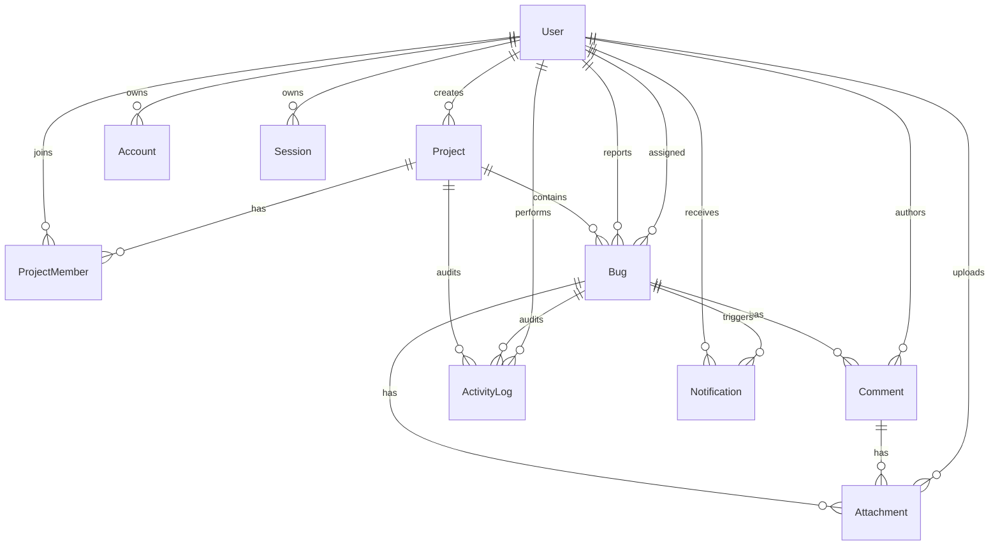
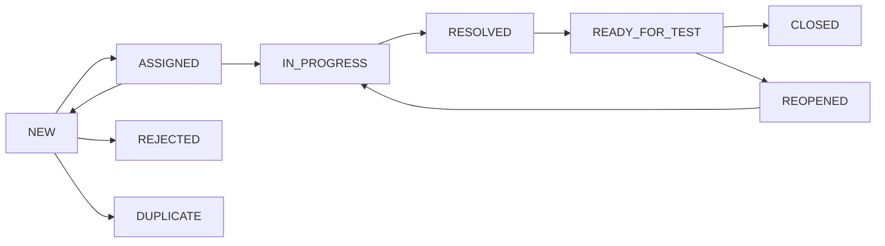

# BugFlow

## Tiếng Việt

### Giới thiệu

BugFlow là hệ thống theo dõi lỗi và quản lý issue dành cho nhóm phát triển phần mềm từ 5–30 thành viên. Dự án tập trung vào workflow có kiểm soát, phân quyền phía server, khả năng kiểm toán và triển khai serverless.

> **Mô tả dùng trong CV:** Developed BugFlow, a full-stack bug tracking system using Next.js, React, TypeScript, Prisma and Neon PostgreSQL, featuring role-based access control, issue workflow validation, developer assignment, comments, activity auditing, notifications, advanced filtering, dashboards and serverless deployment on Vercel.

### Trạng thái hiện tại

Phase 1–8 đã hoàn thành. Dự án hiện có:

- Nền tảng Next.js và Neon PostgreSQL.
- Authentication và authorization.
- Quản lý project và thành viên.
- Bug core với mã bug an toàn trong transaction.
- Tạo, chỉnh sửa, tìm kiếm, lọc, sắp xếp và phân trang bug phía server.
- Priority, severity và phân công developer kèm activity/notification.
- Workflow chuyển trạng thái theo vai trò, comment có mention, activity timeline và notification polling mỗi 30 giây.
- Dashboard tổng quan và dashboard theo project với aggregation, overview cards và biểu đồ Recharts.
- Attachment Cloudinary có validation/phân quyền và Kanban DnD Kit có optimistic rollback.

Phạm vi MVP theo 8 phase đã hoàn thành; các mục E2E và vận hành production cần tiếp tục được xác minh trước khi phát hành thật.

Xem tiến độ chi tiết tại [`nhat-ki-phases.md`](./nhat-ki-phases.md).

### Công nghệ

- Next.js 16 App Router, React 19, TypeScript
- Tailwind CSS 4, shadcn/ui conventions, Lucide React
- Auth.js Credentials, JWT sessions, bcryptjs
- React Hook Form, Zod
- Prisma 7, `@prisma/adapter-pg`, Neon PostgreSQL
- Vitest
- TanStack Query, Recharts, DnD Kit, Cloudinary

### Tính năng đã triển khai

- Đăng ký, đăng nhập và đăng xuất bằng email/mật khẩu.
- JWT session trong HTTP-only cookie; kiểm tra lại tài khoản active ở server.
- System role và project role được kiểm tra tại service layer.
- Cập nhật hồ sơ và đổi mật khẩu.
- Project CRUD, archive, search, filter và pagination.
- Quản lý thành viên và project role.
- Tạo, chỉnh sửa, tìm kiếm, lọc và xem chi tiết bug.
- Sinh bug code an toàn bằng atomic database counter.
- Assign, reassign, unassign và developer self-assignment.
- Activity log và notification record cho các thao tác quan trọng.
- Workflow theo vai trò, comments, mentions, activity timeline và notification polling.
- Dashboard tổng quan; dashboard project với biểu đồ status, priority, severity, assignee và xu hướng 30 ngày.
- Upload/xóa attachment ảnh, video, log, text và PDF trên Cloudinary với preview ảnh.
- Kanban theo project, filter, drag-and-drop, workflow validation, optimistic update và rollback.
- Chống IDOR bằng membership và permission checks phía server.

### Việc mở rộng sau MVP

- Playwright E2E cho các luồng nghiệp vụ chính.
- Rate limiting, realtime notification và observability production.

### Kiến trúc

```text
Browser
  → Server Components / Client Components
  → Server Actions / Route Handlers
  → Zod validation + authentication + authorization
  → Feature services / workflow policies
  → Prisma singleton + PostgreSQL adapter
  → Neon PostgreSQL
```

Business logic nằm trong feature services, không đặt trong page, component hoặc Route Handler. Mỗi mutation xác thực và phân quyền lại ở server. Các query dùng `select`/DTO để không đưa dữ liệu nhạy cảm như `passwordHash` tới client.

#### Cấu trúc thư mục

```text
prisma/                 Schema, migrations và seed idempotent
src/app/                App Router pages và Route Handlers
src/components/ui/      UI primitives theo phong cách shadcn
src/components/         Feature components và shared components
src/features/           Domain services, actions và policies
src/lib/                Auth DAL, Prisma singleton, validation, utilities
src/generated/prisma/   Generated Prisma client, được gitignore
tests/                  Unit tests và service tests
```

### Sơ đồ dữ liệu



`Project.nextBugNumber` được tăng atomic trong transaction. Database áp dụng unique constraint cho `bugCode` và `(projectId, sequenceNumber)`, không dùng cách không an toàn `count + 1`.

### Workflow của bug



Danh sách transition nằm trong `src/features/bugs/workflow.ts`; service Phase 6 kiểm tra actor, project role và assignee trước mọi thay đổi trạng thái.

### Vai trò và quyền

| Chức năng | Admin | Project Manager | Tester | Developer |
|---|---:|---:|---:|---:|
| Quản lý system users | ✓ | | | |
| Tạo project | ✓ | ✓ | | |
| Quản lý project được cấp quyền | ✓ | ✓ | | |
| Tạo và retest bug | ✓ | ✓ | ✓ | |
| Assign developer | ✓ | ✓ | | |
| Xử lý bug được giao | ✓ | ✓ | | ✓ |
| Xác nhận đóng bug | ✓ | ✓ | ✓ | |

System role và project role được đánh giá độc lập. Ẩn/hiện UI chỉ hỗ trợ trải nghiệm; service phía server là nguồn kiểm soát quyền chính.

### Routes chính

#### Giao diện

```text
/
/docs
/login
/register
/dashboard
/projects
/projects/new
/projects/[projectId]
/projects/[projectId]/settings
/bugs
/bugs/new
/bugs/[bugId]
/my-bugs
/profile
```

#### API hiện có

```text
POST         /api/auth/register
GET          /api/users/me

GET/POST     /api/projects
GET/PATCH    /api/projects/[projectId]
POST         /api/projects/[projectId]/members
PATCH/DELETE /api/projects/[projectId]/members/[memberId]

GET/POST     /api/bugs
GET/PATCH    /api/bugs/[bugId]
PATCH        /api/bugs/[bugId]/assignee
PATCH        /api/bugs/[bugId]/priority
PATCH        /api/bugs/[bugId]/severity
```

### Cài đặt local với Neon

#### 1. Tạo database

Tạo một project trên Neon và lấy pooled connection string cho runtime cùng direct connection string cho migration.

#### 2. Cấu hình environment

Sao chép `.env.example` thành `.env.local`, sau đó điền các biến cần thiết. Không commit `.env.local`.

```env
DATABASE_URL="postgresql://...-pooler.../neondb?sslmode=require"
DIRECT_URL="postgresql://.../neondb?sslmode=require"
AUTH_SECRET="your-random-secret"
AUTH_URL="http://localhost:3000"
NEXT_PUBLIC_APP_URL="http://localhost:3000"
```

#### 3. Cài đặt và chạy

```bash
npm install
npm run db:generate
npm run db:deploy
npm run db:seed
npm run dev
```

Mở `http://localhost:3000`. Prisma CLI đọc `DIRECT_URL` qua `prisma.config.ts`; runtime dùng pooled `DATABASE_URL`. Không cần PostgreSQL local hoặc Docker database.

### Tài khoản demo

Các tài khoản sau được tạo bởi `npm run db:seed` và chỉ dùng cho development/demo:

| Vai trò | Email |
|---|---|
| Admin | `admin@bugflow.dev` |
| Project Manager | `manager@bugflow.dev` |
| Tester | `tester@bugflow.dev` |
| Developer | `developer1@bugflow.dev` |
| Developer | `developer2@bugflow.dev` |

```text
Mật khẩu demo: Password@123
```

Đây là mật khẩu demo công khai, không được tái sử dụng cho production hoặc dữ liệu thật.

#### Luồng đăng nhập

1. Mở trang chủ và chọn **Đăng nhập**.
2. Nhập tài khoản demo hoặc tài khoản đã đăng ký.
3. Đăng nhập thành công chuyển tới `/dashboard`.
4. Header hiển thị tên, system role và nút đăng xuất.

Auth.js lưu JWT session được mã hóa trong HTTP-only cookie; ứng dụng không lưu token trong `localStorage`. `proxy.ts` kiểm tra sớm, sau đó server DAL truy vấn lại tài khoản active trước khi truy cập dữ liệu.

Tài liệu công khai dành cho người dùng nằm tại `/docs`; UI không dẫn người dùng thông thường tới source repository.

### Kiểm tra chất lượng

Chạy tuần tự để tránh `type-check` và `next build` cùng ghi `.next/types`:

```bash
npm run lint
npm run test
npm run build
npm run type-check
```

Trạng thái xác minh gần nhất: 15 test files, 39 tests đạt; lint, type-check và production build đều đạt.

### Deploy lên Vercel

1. Tạo Neon database và Cloudinary project; lấy cloud name, API key và API secret.
2. Thêm các biến từ `.env.example` vào Vercel; dùng pooled `DATABASE_URL` cho runtime.
3. Chạy `npm run db:deploy` trong môi trường CI/release tin cậy với `DIRECT_URL`.
4. Deploy Next.js và kiểm tra authentication, database read/write, upload/xóa Cloudinary và giới hạn request body.
5. Không lưu upload trên filesystem của Vercel hoặc expose secret qua `NEXT_PUBLIC_*`.

### Roadmap

Tám phase MVP đã hoàn thành. Bước tiếp theo là E2E production-like, observability, security hardening và release validation.

### Giới hạn hiện tại

- Chưa có Playwright E2E cho workflow hoàn chỉnh.
- Upload Cloudinary thực tế cần credential hợp lệ và chưa được kiểm tra trong môi trường production của người dùng.

### Screenshots

Placeholder — ảnh giao diện sẽ được bổ sung sau khi hoàn thành các phase UI còn lại.

---

## English

### Introduction

BugFlow is a bug tracking and issue management system for software development teams of 5–30 members. The project focuses on controlled workflows, server-side authorization, auditability, and serverless deployment.

> **CV description:** Developed BugFlow, a full-stack bug tracking system using Next.js, React, TypeScript, Prisma and Neon PostgreSQL, featuring role-based access control, issue workflow validation, developer assignment, comments, activity auditing, notifications, advanced filtering, dashboards and serverless deployment on Vercel.

### Current status

Phases 1–8 are complete. The project currently includes:

- A Next.js and Neon PostgreSQL foundation.
- Authentication and authorization.
- Project and membership management.
- A bug core with transaction-safe readable bug codes.
- Server-side bug creation, editing, search, filtering, sorting, and pagination.
- Priority, severity, and developer assignment with activity and notification records.
- Role-aware status transitions, comments with mentions, an activity timeline, and notification polling every 30 seconds.
- Global and per-project dashboards with aggregations, overview cards, and Recharts visualizations.
- Validated Cloudinary attachments and a DnD Kit Kanban board with optimistic rollback.

The eight-phase MVP scope is complete; production-like E2E and operational validation remain before a real release.

See [`nhat-ki-phases.md`](./nhat-ki-phases.md) for the detailed progress log.

### Technology

- Next.js 16 App Router, React 19, TypeScript
- Tailwind CSS 4, shadcn/ui conventions, Lucide React
- Auth.js Credentials, JWT sessions, bcryptjs
- React Hook Form, Zod
- Prisma 7, `@prisma/adapter-pg`, Neon PostgreSQL
- Vitest
- TanStack Query, Recharts, DnD Kit, Cloudinary

### Implemented features

- Email/password registration, sign-in, and sign-out.
- JWT sessions in HTTP-only cookies with server-side active-account checks.
- System roles and project roles enforced in the service layer.
- Profile updates and password changes.
- Project CRUD, archival, search, filtering, and pagination.
- Project membership and project-role management.
- Bug creation, editing, search, filtering, and detail views.
- Concurrency-safe bug codes using an atomic database counter.
- Assignment, reassignment, unassignment, and developer self-assignment.
- Activity and notification records for critical operations.
- Role-aware workflows, comments, mentions, an activity timeline, and notification polling.
- Global overview and project dashboards with status, priority, severity, assignee, and 30-day trend charts.
- Cloudinary upload/deletion for images, videos, logs, text, and PDF files with image previews.
- Project Kanban filtering, drag-and-drop, server workflow validation, optimistic updates, and rollback.
- IDOR protection through server-side membership and permission checks.

### Post-MVP extensions

- Playwright E2E tests for critical business flows.
- Rate limiting, realtime notifications, and production observability.

### Architecture

```text
Browser
  → Server Components / Client Components
  → Server Actions / Route Handlers
  → Zod validation + authentication + authorization
  → Feature services / workflow policies
  → Prisma singleton + PostgreSQL adapter
  → Neon PostgreSQL
```

Business logic lives in feature services rather than pages, components, or Route Handlers. Every mutation revalidates authentication and authorization on the server. Queries use `select`/DTO boundaries so sensitive fields such as `passwordHash` never reach the client.

#### Folder structure

```text
prisma/                 Schema, migrations, and idempotent seed
src/app/                App Router pages and Route Handlers
src/components/ui/      shadcn-style UI primitives
src/components/         Feature and shared components
src/features/           Domain services, actions, and policies
src/lib/                Auth DAL, Prisma singleton, validation, utilities
src/generated/prisma/   Generated Prisma client, gitignored
tests/                  Unit and service tests
```

### Database ERD


`Project.nextBugNumber` is incremented atomically inside a transaction. The database enforces unique constraints on `bugCode` and `(projectId, sequenceNumber)`, avoiding the unsafe `count + 1` pattern.

### Bug workflow


The transition map is centralized in `src/features/bugs/workflow.ts`; the Phase 6 service validates the actor, project role, and assignee before every status change.

### Roles and permissions

| Capability | Admin | Project Manager | Tester | Developer |
|---|---:|---:|---:|---:|
| Manage system users | ✓ | | | |
| Create projects | ✓ | ✓ | | |
| Manage authorized projects | ✓ | ✓ | | |
| Create and retest bugs | ✓ | ✓ | ✓ | |
| Assign developers | ✓ | ✓ | | |
| Work assigned bugs | ✓ | ✓ | | ✓ |
| Confirm bug closure | ✓ | ✓ | ✓ | |

System roles and project roles are evaluated independently. UI visibility is only a convenience; server-side services remain the authorization authority.

### Main routes

#### UI

```text
/
/docs
/login
/register
/dashboard
/projects
/projects/new
/projects/[projectId]
/projects/[projectId]/settings
/bugs
/bugs/new
/bugs/[bugId]
/my-bugs
/profile
```

#### Current API

```text
POST         /api/auth/register
GET          /api/users/me

GET/POST     /api/projects
GET/PATCH    /api/projects/[projectId]
POST         /api/projects/[projectId]/members
PATCH/DELETE /api/projects/[projectId]/members/[memberId]

GET/POST     /api/bugs
GET/PATCH    /api/bugs/[bugId]
PATCH        /api/bugs/[bugId]/assignee
PATCH        /api/bugs/[bugId]/priority
PATCH        /api/bugs/[bugId]/severity
```

### Local setup with Neon

#### 1. Create the database

Create a Neon project and obtain a pooled connection string for runtime and a direct connection string for migrations.

#### 2. Configure the environment

Copy `.env.example` to `.env.local`, then fill in the required variables. Never commit `.env.local`.

```env
DATABASE_URL="postgresql://...-pooler.../neondb?sslmode=require"
DIRECT_URL="postgresql://.../neondb?sslmode=require"
AUTH_SECRET="your-random-secret"
AUTH_URL="http://localhost:3000"
NEXT_PUBLIC_APP_URL="http://localhost:3000"
```

#### 3. Install and run

```bash
npm install
npm run db:generate
npm run db:deploy
npm run db:seed
npm run dev
```

Open `http://localhost:3000`. Prisma CLI reads `DIRECT_URL` through `prisma.config.ts`; runtime uses the pooled `DATABASE_URL`. No local PostgreSQL installation or Docker database is required.

### Demo accounts

The following accounts are created by `npm run db:seed` and are intended only for development/demo use:

| Role | Email |
|---|---|
| Admin | `admin@bugflow.dev` |
| Project Manager | `manager@bugflow.dev` |
| Tester | `tester@bugflow.dev` |
| Developer | `developer1@bugflow.dev` |
| Developer | `developer2@bugflow.dev` |

```text
Demo password: Password@123
```

This is an intentionally public demo password. Never reuse it for production or real data.

#### Sign-in flow

1. Open the home page and select **Đăng nhập**.
2. Enter a demo account or a registered account.
3. Successful authentication redirects to `/dashboard`.
4. The header displays the current name, system role, and sign-out control.

Auth.js stores the encrypted JWT session in an HTTP-only cookie; the application does not store tokens in `localStorage`. `proxy.ts` performs an optimistic check, while the server DAL queries the active account again before data access.

Public user documentation is available at `/docs`; the product UI does not direct ordinary users to the source repository.

### Quality checks

Run sequentially to avoid `type-check` and `next build` writing to `.next/types` at the same time:

```bash
npm run lint
npm run test
npm run build
npm run type-check
```

Latest verified state: 15 test files, 39 passing tests; lint, type-check, and production build all pass.

### Deploy to Vercel

1. Create Neon and Cloudinary projects; obtain the cloud name, API key, and API secret.
2. Add variables from `.env.example` to Vercel; use the pooled `DATABASE_URL` at runtime.
3. Run `npm run db:deploy` in a trusted CI/release environment with `DIRECT_URL`.
4. Deploy Next.js and verify authentication, database read/write, Cloudinary upload/deletion, and request body limits.
5. Never store uploads on Vercel's filesystem or expose secrets through `NEXT_PUBLIC_*`.

### Roadmap

All eight MVP phases are complete. Next steps are production-like E2E, observability, security hardening, and release validation.

### Current limitations

- No Playwright E2E coverage for the complete workflow yet.
- Live Cloudinary upload still requires valid credentials and production-environment verification.

### Screenshots

Placeholder — product screenshots will be added after the remaining UI phases are complete.
