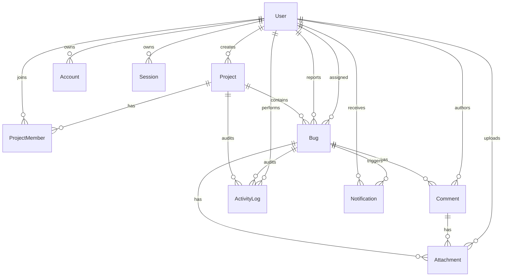
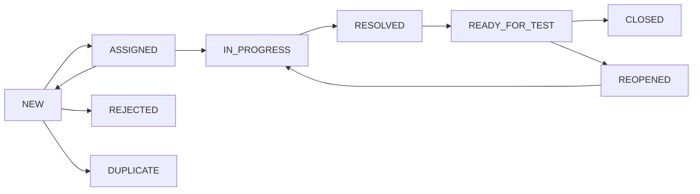

# BugFlow

**Hệ thống theo dõi lỗi và quản lý issue cho nhóm phát triển phần mềm.**
**A bug tracking and issue management system for software development teams.**

BugFlow được thiết kế cho nhóm từ 5–30 thành viên, tập trung vào workflow có kiểm soát, phân quyền phía server, khả năng kiểm toán và triển khai serverless.

BugFlow is designed for teams of 5–30 members, focusing on controlled workflows, server-side authorization, auditability, and serverless deployment.

> **CV description:** Developed BugFlow, a full-stack bug tracking system using Next.js, React, TypeScript, Prisma and Neon PostgreSQL, featuring role-based access control, issue workflow validation, developer assignment, comments, activity auditing, notifications, advanced filtering, dashboards and serverless deployment on Vercel.

## Trạng thái hiện tại | Current status

Phase 1–5 đã hoàn thành. Dự án hiện có nền tảng Next.js/Neon, authentication, quản lý project và bug core: mã bug an toàn trong transaction, tạo/chỉnh sửa bug, tìm kiếm–lọc–sắp xếp–phân trang phía server, trang chi tiết, priority/severity và phân công developer kèm activity/notification.

Phases 1–5 are complete. The project now includes the Next.js/Neon foundation, authentication, project management, and the bug core: transaction-safe readable bug codes, bug reporting/editing, server-side search/filter/sort/pagination, detail views, priority/severity controls, and transactional developer assignment with activity and notification records.

Phase 6 chưa bắt đầu: workflow transition đầy đủ, comments, activity timeline và notification polling.

Phase 6 has not started: full workflow transitions, comments, activity timeline, and notification polling.

Xem tiến độ chi tiết tại [`nhat-ki-phases.md`](./nhat-ki-phases.md).
See the detailed progress log in [`nhat-ki-phases.md`](./nhat-ki-phases.md).

## Công nghệ | Technology

- Next.js 16 App Router, React 19, TypeScript
- Tailwind CSS 4, shadcn/ui conventions, Lucide React
- Auth.js Credentials, JWT sessions, bcryptjs
- React Hook Form, Zod
- Prisma 7, `@prisma/adapter-pg`, Neon PostgreSQL
- Vitest
- Dự kiến | Planned: TanStack Query, Recharts, DnD Kit, Cloudinary

## Tính năng | Features

### Đã triển khai | Implemented

- Đăng ký, đăng nhập, đăng xuất bằng email và mật khẩu.
  Email/password registration, sign-in, and sign-out.
- JWT session trong HTTP-only cookie; kiểm tra lại tài khoản active ở server.
  JWT sessions in HTTP-only cookies with server-side active-account verification.
- System role và project role; kiểm tra quyền tại service layer.
  System roles and project roles enforced in the service layer.
- Cập nhật hồ sơ và đổi mật khẩu.
  Profile updates and password changes.
- Project CRUD, archive, search, filter và pagination.
  Project CRUD, archival, search, filtering, and pagination.
- Quản lý thành viên và project role.
  Project membership and project-role management.
- Tạo, chỉnh sửa, tìm kiếm, lọc và xem chi tiết bug.
  Bug creation, editing, search, filtering, and detail views.
- Sinh bug code an toàn bằng atomic database counter.
  Concurrency-safe bug codes using an atomic database counter.
- Assign, reassign, unassign và developer self-assignment.
  Assignment, reassignment, unassignment, and developer self-assignment.
- Activity log và notification record cho các thao tác quan trọng đã triển khai.
  Activity and notification records for implemented critical operations.
- Chống IDOR bằng membership/permission checks phía server.
  IDOR protection through server-side membership and permission checks.

### Sắp triển khai | Planned

- Workflow transition đầy đủ theo vai trò.
  Complete role-aware status transitions.
- Comments, mentions và activity timeline.
  Comments, mentions, and activity timeline.
- Notification polling với TanStack Query.
  Notification polling with TanStack Query.
- Dashboard, charts, attachments và Kanban.
  Dashboards, charts, attachments, and Kanban.
- Playwright E2E cho các luồng nghiệp vụ chính.
  Playwright E2E coverage for critical business flows.

## Kiến trúc | Architecture

```text
Browser
  → Server Components / Client Components
  → Server Actions / Route Handlers
  → Zod validation + authentication + authorization
  → Feature services / workflow policies
  → Prisma singleton + PostgreSQL adapter
  → Neon PostgreSQL
```

Business logic nằm trong feature services, không đặt trong page/component hoặc Route Handler. Mỗi mutation xác thực và phân quyền lại ở server. Các query dùng `select`/DTO để không đưa dữ liệu nhạy cảm như `passwordHash` tới client.

Business logic lives in feature services rather than pages, components, or Route Handlers. Every mutation revalidates authentication and authorization on the server. Queries use `select`/DTO boundaries so sensitive fields such as `passwordHash` never reach the client.

### Cấu trúc thư mục | Folder structure

```text
prisma/                 Schema, migrations, and idempotent seed
src/app/                App Router pages and Route Handlers
src/components/ui/      shadcn-style UI primitives
src/components/         Feature and shared components
src/features/           Domain services, actions, and policies
src/lib/                Auth DAL, Prisma singleton, validation, utilities
src/generated/prisma/   Generated Prisma client (gitignored)
tests/                  Unit and service tests
```

## Sơ đồ dữ liệu | Database ERD



`Project.nextBugNumber` được tăng atomic trong transaction. Database đồng thời áp dụng unique constraint cho `bugCode` và `(projectId, sequenceNumber)`, không dùng cách không an toàn `count + 1`.

`Project.nextBugNumber` is incremented atomically inside a transaction. The database also enforces unique constraints on `bugCode` and `(projectId, sequenceNumber)`, avoiding the unsafe `count + 1` pattern.

## Workflow của bug | Bug workflow



Danh sách transition đã được tập trung trong `src/features/bugs/workflow.ts`. Validation theo actor/role và UI transition đầy đủ thuộc Phase 6.

The transition map is centralized in `src/features/bugs/workflow.ts`. Full actor/role validation and transition UI belong to Phase 6.

## Vai trò và quyền | Roles and permissions

| Chức năng / Capability | Admin | Project Manager | Tester | Developer |
|---|---:|---:|---:|---:|
| Quản lý system users / Manage system users | ✓ | | | |
| Tạo project / Create projects | ✓ | ✓ | | |
| Quản lý project khi có project role phù hợp / Manage authorized projects | ✓ | ✓ | | |
| Tạo và retest bug / Create and retest bugs | ✓ | ✓ | ✓ | |
| Assign developer / Assign developers | ✓ | ✓ | | |
| Xử lý bug được giao / Work assigned bugs | ✓ | ✓ | | ✓ |
| Xác nhận đóng bug / Confirm bug closure | ✓ | ✓ | ✓ | |

System role và project role được đánh giá độc lập. Ẩn/hiện UI chỉ hỗ trợ trải nghiệm; service phía server mới là nguồn kiểm soát quyền chính.

System roles and project roles are evaluated independently. UI visibility is only a convenience; server-side services remain the authorization authority.

## Routes chính | Main routes

### Giao diện | UI

```text
/
/docs
/login
/register
/dashboard
/projects
/projects/new
/projects/[projectId]
/projects/[projectId]/settings
/bugs
/bugs/new
/bugs/[bugId]
/my-bugs
/profile
```

### API hiện có | Current API

```text
POST       /api/auth/register
GET        /api/users/me

GET/POST   /api/projects
GET/PATCH  /api/projects/[projectId]
POST       /api/projects/[projectId]/members
PATCH/DELETE /api/projects/[projectId]/members/[memberId]

GET/POST   /api/bugs
GET/PATCH  /api/bugs/[bugId]
PATCH      /api/bugs/[bugId]/assignee
PATCH      /api/bugs/[bugId]/priority
PATCH      /api/bugs/[bugId]/severity
```

## Cài đặt local với Neon | Local setup with Neon

### 1. Tạo database | Create the database

Tạo một project trên Neon và lấy hai connection strings: pooled connection cho runtime và direct connection cho migration.

Create a Neon project and obtain two connection strings: a pooled connection for runtime and a direct connection for migrations.

### 2. Cấu hình environment | Configure the environment

Sao chép `.env.example` thành `.env.local` và điền các biến cần thiết. Không commit `.env.local`.

Copy `.env.example` to `.env.local` and fill in the required variables. Never commit `.env.local`.

```env
DATABASE_URL="postgresql://...-pooler.../neondb?sslmode=require"
DIRECT_URL="postgresql://.../neondb?sslmode=require"
AUTH_SECRET="your-random-secret"
AUTH_URL="http://localhost:3000"
NEXT_PUBLIC_APP_URL="http://localhost:3000"
```

### 3. Cài đặt và chạy | Install and run

```bash
npm install
npm run db:generate
npm run db:deploy
npm run db:seed
npm run dev
```

Mở `http://localhost:3000`. Prisma CLI đọc `DIRECT_URL` qua `prisma.config.ts`; runtime dùng pooled `DATABASE_URL`. Không cần PostgreSQL local hoặc Docker database.

Open `http://localhost:3000`. Prisma CLI reads `DIRECT_URL` through `prisma.config.ts`; runtime uses pooled `DATABASE_URL`. No local PostgreSQL installation or Docker database is required.

## Tài khoản demo | Demo accounts

Các tài khoản dưới đây được tạo bởi `npm run db:seed` và chỉ dành cho development/demo.

The accounts below are created by `npm run db:seed` and are intended only for development/demo use.

| Vai trò / Role | Email |
|---|---|
| Admin | `admin@bugflow.dev` |
| Project Manager | `manager@bugflow.dev` |
| Tester | `tester@bugflow.dev` |
| Developer | `developer1@bugflow.dev` |
| Developer | `developer2@bugflow.dev` |

```text
Demo password: Password@123
```

Đây là mật khẩu demo công khai và không được tái sử dụng cho production hoặc dữ liệu thật.

This is an intentionally public demo password. Never reuse it for production or real data.

### Luồng đăng nhập | Sign-in flow

1. Mở trang chủ và chọn **Đăng nhập**.
   Open the home page and select **Đăng nhập**.
2. Nhập một tài khoản demo hoặc tài khoản đã đăng ký.
   Enter a demo account or a registered account.
3. Đăng nhập thành công chuyển tới `/dashboard`.
   Successful authentication redirects to `/dashboard`.
4. Header hiển thị tên, system role và nút đăng xuất.
   The header displays the current name, system role, and sign-out control.

Auth.js lưu JWT session được mã hóa trong HTTP-only cookie; ứng dụng không lưu token trong `localStorage`. `proxy.ts` chỉ kiểm tra sớm, sau đó server DAL truy vấn lại tài khoản active trước khi truy cập dữ liệu.

Auth.js stores the encrypted JWT session in an HTTP-only cookie; the application does not store tokens in `localStorage`. `proxy.ts` performs an optimistic check, while the server DAL queries the active account again before data access.

Tài liệu công khai dành cho người dùng nằm tại `/docs`; UI không dẫn user thông thường tới source repository.

Public user documentation is available at `/docs`; the product UI does not direct ordinary users to the source repository.

## Kiểm tra chất lượng | Quality checks

Chạy tuần tự để tránh `type-check` và `next build` cùng ghi `.next/types`.

Run sequentially to avoid `type-check` and `next build` writing to `.next/types` at the same time.

```bash
npm run lint
npm run test
npm run build
npm run type-check
```

Trạng thái gần nhất: 8 test files, 21 tests đạt; lint, type-check và production build đều đạt.

Latest verified state: 8 test files, 21 passing tests; lint, type-check, and production build all pass.

## Deploy lên Vercel | Deploy to Vercel

1. Tạo Neon database và Cloudinary project khi attachment được triển khai.
   Create a Neon database and a Cloudinary project when attachments are implemented.
2. Thêm các biến từ `.env.example` vào Vercel; dùng pooled `DATABASE_URL` cho runtime.
   Add variables from `.env.example` to Vercel; use the pooled `DATABASE_URL` at runtime.
3. Chạy `npm run db:deploy` trong môi trường CI/release tin cậy với `DIRECT_URL`.
   Run `npm run db:deploy` in a trusted CI/release environment with `DIRECT_URL`.
4. Deploy Next.js và kiểm tra authentication, database read/write.
   Deploy Next.js and verify authentication and database read/write operations.
5. Không lưu upload trên filesystem của Vercel hoặc expose secret qua `NEXT_PUBLIC_*`.
   Never store uploads on Vercel's filesystem or expose secrets through `NEXT_PUBLIC_*`.

## Roadmap

1. **Phase 6:** workflow transitions, comments, activity timeline, notification polling.
2. **Phase 7:** dashboard aggregations, overview cards, charts, project dashboard.
3. **Phase 8:** attachments, Kanban, accessibility, responsive polish, E2E, deployment.

## Giới hạn hiện tại | Current limitations

- Chưa có comment UI, mention hoặc notification polling.
  No comment UI, mentions, or notification polling yet.
- Chưa có dashboard analytics hoặc charts.
  No dashboard analytics or charts yet.
- Chưa có attachment upload/storage integration.
  No attachment upload/storage integration yet.
- Chưa có Kanban và drag-and-drop.
  No Kanban or drag-and-drop yet.
- Chưa có Playwright E2E cho workflow hoàn chỉnh.
  No Playwright E2E coverage for the complete workflow yet.

## Screenshots

Placeholder — ảnh giao diện sẽ được bổ sung sau khi hoàn thành các phase UI còn lại.
Placeholder — product screenshots will be added after the remaining UI phases are complete.
